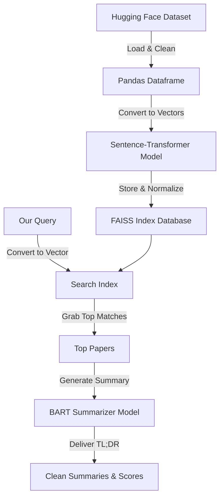

# AI Research Paper Search & TL;DR Summarizer

This project is a friendly assistant that helps us search through a stack of machine learning research papers using semantic search (what they actually mean) rather than exact keyword matches. Once it finds the best matches, it uses a BART transformer model to give us a quick, clean TL;DR summary of the abstracts.

---

## What does this do? (Project Overview)

Keyword searches often miss relevant papers if they use synonyms. Our pipeline fixes this by:
1. **Understanding the Vibe (Semantic Search):** We translate titles and abstracts into mathematical vectors (embeddings) that capture the actual meaning of the text using the `all-MiniLM-L6-v2` model.
2. **Lightning-Fast Lookup:** We index those vectors using **FAISS** to query 15,000 papers in milliseconds.
3. **Instant TL;DRs:** We run the top results through a `bart-large-cnn` model to generate brief summaries.

---

## Where's the data from? (Dataset Description)

We use the [ML-ArXiv-Papers](https://huggingface.co/datasets/CShorten/ML-ArXiv-Papers) dataset on Hugging Face. To keep things fast and RAM-friendly, we crop the 117k dataset down to the **first 15,000 papers**. We clean the text by gluing `title` and `abstract` together into a single `paper_text` field, removing newlines, and stripping extra spaces.

---

## The Pipeline: How it all hooks up



---

## Technologies Used

- **Sentence Transformers:** Specifically `all-MiniLM-L6-v2` to vectorize paper text.
- **FAISS:** For lightning-fast similarity search.
- **Hugging Face Transformers:** Using `bart-large-cnn` to handle the text summarization.
- **Datasets:** To pull down the ArXiv dataset.
- **Pandas & NumPy:** For general data wrangling and handling embeddings.

---

## How Semantic Search Works

Traditional searches look for exact words. If we search for "doctor", they might completely miss a paper that talks about a "physician". 

Semantic search fixes this by transforming our text into dense numerical lists (embeddings). These embeddings represent the actual meaning of the sentences. By measuring the angle or distance between our search query vector and the paper vectors (using inner product / cosine similarity), we can pull up the most relevant papers even if they do not share a single word with our query.

---

## Why FAISS?

Comparing our search query to thousands of 384-dimensional vectors one-by-one is slow and does not scale well. FAISS (Facebook AI Similarity Search) is built specifically to solve this. It is a highly optimized library written in C++ that makes finding nearest neighbor vectors incredibly efficient, reducing our search times to milliseconds.

---

## Setup & Quick Start

1. **Install dependencies:**
   ```bash
   pip install -r requirements.txt
   ```

2. **Run it:**
   ```python
   import faiss
   import pandas as pd
   from datasets import load_dataset
   from sentence_transformers import SentenceTransformer
   from transformers import pipeline

   # Load data
   dataset = load_dataset("CShorten/ML-ArXiv-Papers", split='train')
   df = pd.DataFrame(dataset).head(15000)
   df["paper_text"] = (df["title"] + " " + df["abstract"]).str.replace("\n", " ").str.strip()

   # Load models
   model = SentenceTransformer("sentence-transformers/all-MiniLM-L6-v2")
   summarizer = pipeline("summarization", model="facebook/bart-large-cnn")

   # Create FAISS search index
   embeddings = model.encode(df["paper_text"].tolist(), batch_size=32, show_progress_bar=True)
   faiss.normalize_L2(embeddings)
   index = faiss.IndexFlatIP(384)
   index.add(embeddings)

   # Query
   query = "deep learning for medical image analysis"
   query_embedding = model.encode([query])
   faiss.normalize_L2(query_embedding)
   scores, indices = index.search(query_embedding, k=3)

   # Show top results with TL;DR
   for score, idx in zip(scores[0], indices[0]):
       print(f"Match Score: {score:.4f} | Title: {df.iloc[idx]['title']}")
       summary = summarizer(df.iloc[idx]['abstract'], max_length=120, min_length=40)[0]['summary_text']
       print(f"TL;DR: {summary}\n")
   ```
