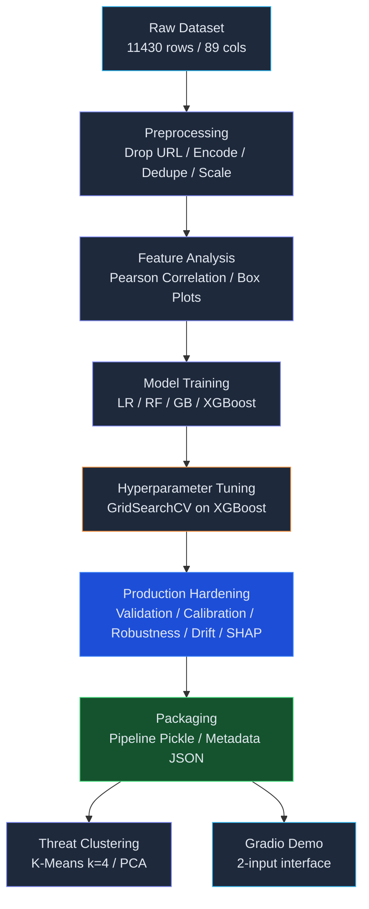
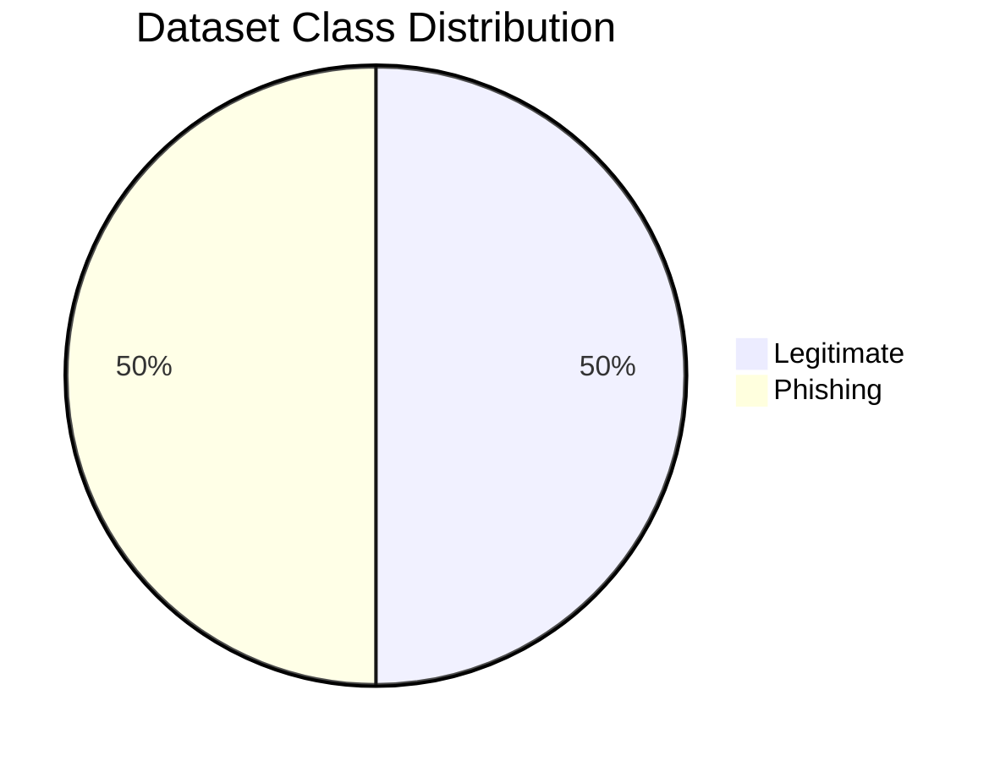
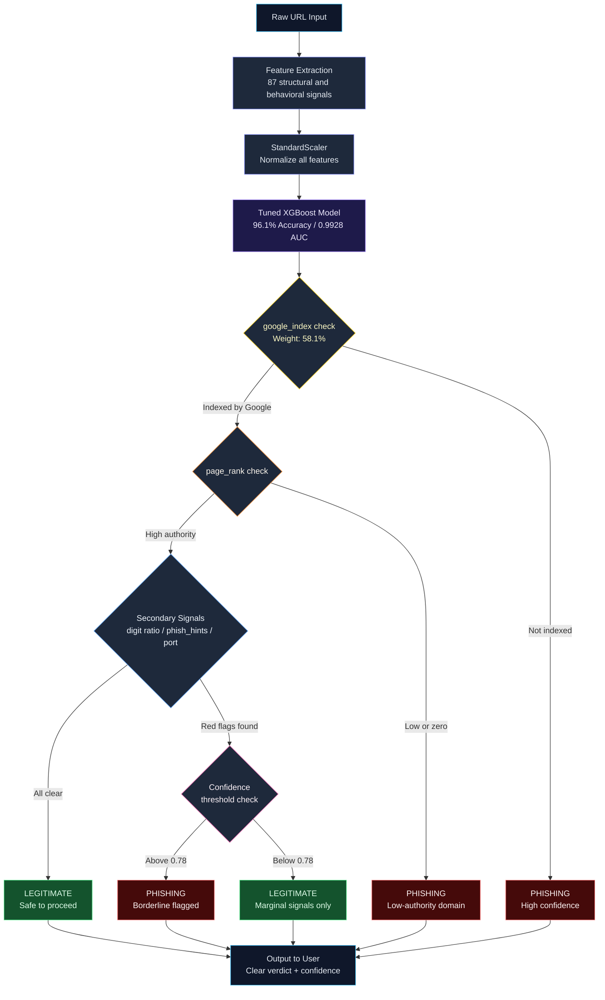
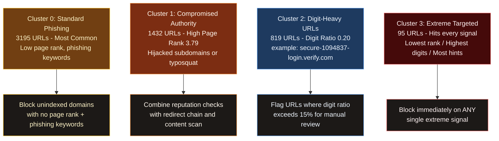

## Introduction

Phishing attacks are one of the most persistent threats in cybersecurity — and yet they often work because they're surprisingly hard to catch at a glance. A URL can look completely normal to a human while hiding dozens of subtle signals that give it away as malicious.

**JoltKey** is a proper end-to-end machine learning pipeline to tackle this. The name comes from the idea of a key that *"jolts"* — detecting the threat before it unlocks any damage. 

Originally built as a strong coursework project, this repository has been directly upgraded to a **production-ready, security-hardened ML pipeline**. The codebase features rigorous validation frameworks (Bootstrap CIs, Stratified CV), threat-model checks (ablation tests, dominance warnings), model calibration, SHAP explainability, robustness stress testing, uncertainty guardrails, drift monitoring, and unified inference serialization.

---

## Problem Statement

Phishing URLs are designed to deceive. They mimic legitimate sites, use lookalike domain names, and exploit user trust to steal credentials or deploy malware. Traditional rule-based detection systems struggle to keep up because attackers constantly change their tactics.

> **Core Question:** Can we train a machine learning model to reliably distinguish phishing URLs from legitimate ones using only their structural and behavioral features — without ever visiting the page itself?

That is exactly what JoltKey sets out to answer.

---

## Approach and Methodology



| Step | What Happened |
|---|---|
| **Data Loading** | Pulled dataset via `kagglehub`, checked class distributions, identified nulls and duplicates. |
| **Preprocessing** | Dropped raw URL column, encoded target label (`legitimate=0`, `phishing=1`), removed duplicate rows, applied `StandardScaler`. |
| **Feature Analysis** | Computed Pearson correlation of all 87 features with the target, visualized using box plots. |
| **Model Training** | Compared four classifiers (Logistic Regression, Random Forest, GBDT, XGBoost) with stratified splits. |
| **Tuning** | Applied `GridSearchCV` on XGBoost — the clear top performer. |
| **Production Upgrades** | Stratified CV metrics, Bootstrap CIs, Calibration curve, Feature Ablation, SHAP, Robustness stress-testing, Drift check. |
| **Threat Clustering** | K-Means (k=4 via Elbow Method) on confirmed phishing URLs + PCA visualization. |
| **Demo & Serialization**| Gradio interface; Saved unified pipeline pickling scaler/model + metadata JSON. |

---

## Dataset

| Property | Detail |
|---|---|
| **Source** | [Web Page Phishing Detection Dataset](https://www.kaggle.com/datasets/shashwatwork/web-page-phishing-detection-dataset) by Shashwat |
| **Original Size** | 11,430 rows x 89 columns |
| **After Cleaning** | 11,256 samples x 87 features |
| **Target** | `status` — `legitimate` (0) or `phishing` (1) |
| **Class Balance** | Perfectly balanced (5,628 legitimate, 5,628 phishing) |
| **Missing Values** | None |

Feature categories include URL length, digit ratios, special character counts, IP address presence, page rank, domain age, hyperlink counts, and more.



---

## Model Development and Results

Four classifiers were built and evaluated on the held-out test set of **2,252 samples**.

```
Logistic Regression  [=========---------]  89.0%
Random Forest        [===============---]  95.0%
Gradient Boosting    [===============---]  95.0%
Tuned XGBoost        [=================-]  96.1%  <-- WINNER
```

| Model | Accuracy | Precision | Recall | F1 Score | ROC-AUC |
|---|:---:|:---:|:---:|:---:|:---:|
| Logistic Regression | ~89% | — | — | — | — |
| Random Forest | ~95% | — | — | — | — |
| Gradient Boosting | ~95% | — | — | — | — |
| **Tuned XGBoost** | **96.1%** | **0.961** | **0.961** | **0.961** | **0.9928** |

### URL Detection Decision Flow



---

## Production Readiness & ML Security Rigor

### 1. Hardened Validation Framework
To verify generalizability, we evaluate the tuned XGBoost model using Stratified K-Fold CV on training data and bootstrap confidence intervals on the test set:

| Metric | 5-Fold CV Mean +/- Std | Test Set Mean (95% Bootstrap CI) |
| :--- |:---:|:---:|
| **ROC-AUC** | 0.9944 +/- 0.0009 | **0.9928** [0.9902, 0.9953] |
| **PR-AUC** | 0.9946 +/- 0.0007 | **0.9924** [0.9892, 0.9952] |
| **F1 Score** | 0.9665 +/- 0.0035 | **0.9608** [0.9523, 0.9690] |
| **Precision** | 0.9685 +/- 0.0049 | **0.9606** [0.9488, 0.9722] |
| **Recall** | 0.9646 +/- 0.0063 | **0.9611** [0.9500, 0.9720] |
| **Balanced Accuracy** | 0.9671 +/- 0.0034 | **0.9614** [0.9534, 0.9694] |
| **MCC** | 0.9343 +/- 0.0068 | **0.9228** [0.9068, 0.9387] |

### 2. Leakage and Shortcut Checks
* **Dominance Check**: Feature importances are checked. A dominance warning is flagged if a single feature accounts for $>40\%$ of the model's total importance. In our dataset, `google_index` has an importance of **58.10%**, prompting a data-shortcut warning.
* **Feature Ablation**:
  * Removing top 1 feature (`google_index`): Test ROC-AUC remains strong at **0.9924**.
  * Removing top 3 features (`google_index`, `page_rank`, `nb_qm`): Test ROC-AUC = **0.9902**.
  * Removing top 5 features: Test ROC-AUC = **0.9900**.
  * *Insight: The model does not suffer from single-feature leakage collapse; secondary features are highly predictive.*

### 3. Business Threshold Strategy
We sweep thresholds 0.1 to 0.9 to find the threshold that maximizes recall under a strict False Positive Rate (FPR) constraint (FPR <= 2%):
* **Optimal Decision Threshold**: **0.78**
* **FPR achieved**: **1.92%** (only 22 false alarms out of 1,143 legitimate cases)
* **Phishing Recall**: **94.77%** (blocks 1,051 out of 1,109 actual attacks)
* **Precision**: **97.95%**

```
                    Predicted (Threshold = 0.78)
                 +--------------+--------------+
                 | Legitimate   |  Phishing    |
       +---------+--------------+--------------+
Actual |Legitimate|   1121 OK    |    22 FP     |
       +---------+--------------+--------------+
       |Phishing |    58 FN     |   1051 OK    |
       +---------+--------------+--------------+
```

### 4. Calibration and Trust
We compute the Brier score to assess the calibration of model probabilities:
* **Brier Score**: **0.0290** (excellent calibration, meaning a 90% risk score corresponds to an actual 90% probability of phishing).

### 5. Robustness & Abstain Guardrails
* **Noise Stress Test**: Perturbing key numeric features (`length_url`, `ratio_digits_url`) with 10% Gaussian noise shows high prediction stability (**99.73%**).
* **Uncertainty Abstention**: Predictions falling in the high-uncertainty margin $[0.40, 0.60]$ are flagged for manual review rather than automated action.
  * **Manual Review Rate**: Only **0.80%** (18 of 2,252 cases).
  * **Accuracy on automated decisions**: Increases to **96.87%**.

### 6. Drift Readiness
Population Stability Index (PSI) is computed for top features between training and test sets to establish baseline drift check scripts:
* All top features (`google_index`, `page_rank`, `nb_qm`, `nb_hyperlinks`, `nb_www`) show **PSI < 0.1**, indicating no statistical drift between splits.

---

## Explainability (SHAP)

Global feature summary plots show how features drive predictions. We provide analyst-friendly local decision templates:

**Analyst Decision Template Example:**
```
--- Analyst Decision Sheet: Phishing Case (Test Row Index: 0) ---
Risk Probability: 96.51%
Model Recommendation: 🚨 BLOCK

Top Contributing Features to Decision:
  - google_index = 1.0 (INCREASE risk by 2.1456)
  - nb_www = 0.0 (INCREASE risk by 0.8226)
  - domain_in_title = 0.0 (DECREASE risk by 0.5996)
  - length_url = 24.0 (INCREASE risk by 0.5357)
  - domain_age = 5509.0 (DECREASE risk by 0.4387)
```

---

## Threat Clustering and Security Recommendations

K-Means clustering on confirmed phishing samples identifies 4 distinct attack profiles:



---

## Gradio Demo

The Gradio interface strips away all the complexity — the user fills in just **2 fields**, and the system handles all 87 feature engineering steps internally before running through the tuned XGBoost model.

- **No CSV uploads** required
- **No manual feature engineering** needed
- Runs directly on Kaggle — enable Internet access for a public shareable link

---

## Challenges and Learnings

> [!NOTE]
> **The `google_index` anomaly** — One feature carrying 58.1% of the importance weight looked like a data leak at first. Spending time verifying it as a genuine signal (not an artifact) was important and worth it.
> Since phishing domains are short-lived, search engines rarely index them.

> [!NOTE]
> **Interpreting K-Means clusters** — Translating raw statistics into actionable threat profiles required thinking from a security standpoint, not just data analysis.

---

## Future Improvements

| Priority | Improvement | Impact |
|---|---|---|
| High | **Real-time URL feature extraction** — parse all 87 features from a raw URL on the fly | Production-ready demo |
| High | **Deployment Integration** — build FastAPI microservice | REST API ready |
| Medium | **Continuous Retraining** — update model with new phishing URLs | Anti-drift pipeline |

---

## Production Packaging

To prepare the model for deployment, the pipeline exports two production artifacts:
1. **`phishing_inference_pipeline.pkl`**: A single serialized package wrapping the `StandardScaler` and the tuned `XGBoost` model.
2. **`phishing_model_metadata.json`**: An audit trail documenting model metadata, validation metrics, threshold rules, feature sets, and package versions.

---

## How to Run

1. Open `phishing_detection.ipynb` on Kaggle or a local Jupyter environment.
2. Ensure the required packages are installed:
   ```bash
   pip install scikit-learn xgboost shap gradio kagglehub pandas numpy matplotlib seaborn joblib
   ```
3. Run all cells. The pipeline automatically downloads and extracts the dataset, trains the models, runs the security-hardening steps, and saves the final production artifacts to disk.

---


