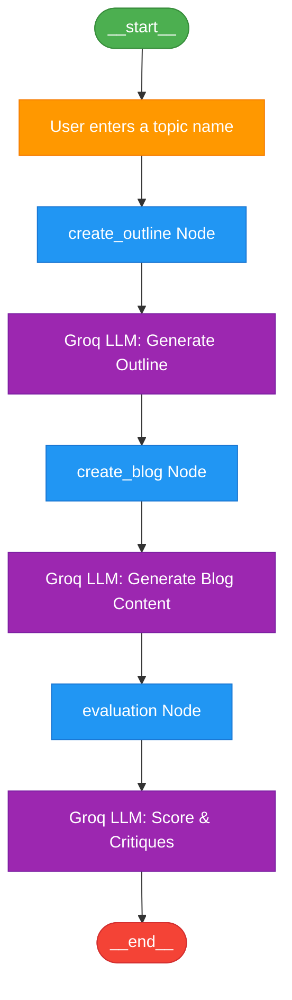
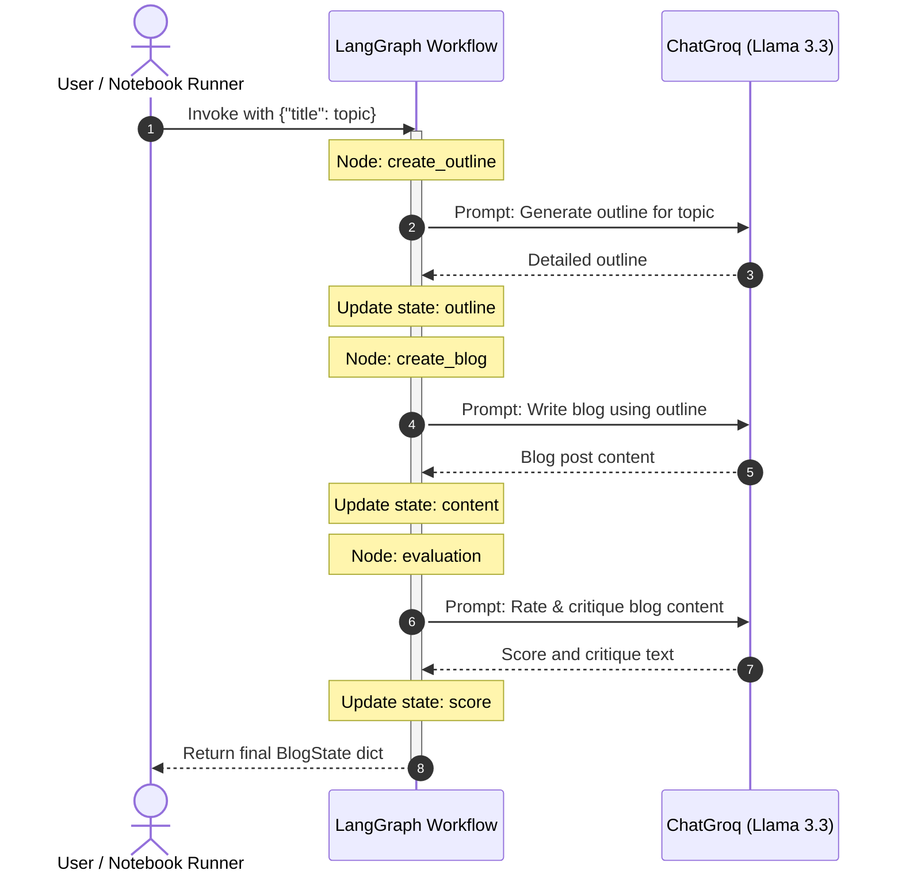

# Agentic AI: Blog Generation & Evaluation Workflow

This repository contains a LangGraph-based agentic workflow that automates the generation and evaluation of high-quality blog posts. It leverages prompt chaining within a state machine (StateGraph) powered by the `llama-3.3-70b-versatile` model via Groq.

## Project Structure

- `02_prompt_chaining_blog_evaluate.ipynb`: The main Jupyter Notebook implementing the LangGraph state machine, node functions, and execution.
- `requirements.txt`: Python package requirements for running this project.

## Workflow Architecture

The workflow is modeled as a state machine using **LangGraph**. The state is defined using a `BlogState` dictionary:

```python
class BlogState(TypedDict):
    title: str       # The title/topic of the blog post
    outline: str     # The generated outline structure
    content: str     # The final written blog content
    score: float     # The evaluation score and feedback
```

### Nodes & Edges

The workflow runs sequentially through the nodes, prompting the user for input and invoking the LLM at each step:



### Sequence Flow

The interaction sequence among the Runner (Jupyter Notebook), the LangGraph Engine, and the Groq LLM is illustrated below:



1. **`create_outline`**: Takes the blog title and prompts the Groq LLM to generate a detailed outline.
2. **`create_blog`**: Takes the title and the outline to write a comprehensive blog post.
3. **`evaluation`**: Rates the final blog post out of 10 and provides strengths, weaknesses, and improvement suggestions.

---

## Setup & Installation

### 1. Clone & Navigate
Navigate to this project directory:
```bash
cd 04_Agentic_AI
```

### 2. Configure Environment Variables
Create a `.env` file in the root of this folder and add your Groq API key:
```env
GROQ_API_KEY=your_groq_api_key_here
```

### 3. Install Dependencies
It is recommended to use a virtual environment:
```bash
python -m venv venv
# On Windows
.\venv\Scripts\activate
# On macOS/Linux
source venv/bin/activate

pip install -r requirements.txt
```

---

## Usage

1. Open the Jupyter Notebook `02_prompt_chaining_blog_evaluate.ipynb` using VS Code or Jupyter Lab.
2. Run all cells sequentially.
3. Input your desired blog topic when prompted.
4. The workflow will execute the Graph and return the output dictionary containing:
   - The generated detailed outline.
   - The final blog post content.
   - A detailed evaluation score (out of 10) with suggestions for improvement.
