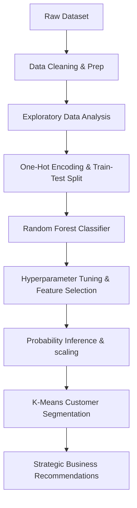

# Telco Customer Churn: Prediction & Segmentation

An end-to-end Machine Learning project that explores factors behind customer churn in a telecommunications dataset, builds a predictive classifier using **Random Forest**, and segments customers using **K-Means Clustering** to deliver actionable business retention strategies.

---

## Repository Structure

- **[customer_churn.ipynb](customer_churn.ipynb)**: Main Jupyter notebook containing data cleaning, exploratory data analysis (EDA), predictive modeling, and clustering.
- **[requirements.txt](requirements.txt)**: List of dependencies required to run the notebook.
- **`Telco_customer_churn.xlsx`**: Raw source dataset containing customer details (demographics, services, payment, and churn flags). _Note: Place this in the root directory before running._

---

## Getting Started

### Prerequisites

Clone this repository and install dependencies in your virtual environment:

```bash
# Clone the repository (or open in workspace)
pip install -r requirements.txt
```

### Execution

1. Make sure `Telco_customer_churn.xlsx` is located in the root folder.
2. Launch Jupyter or VS Code and run the notebook cells sequentially:
   ```bash
   jupyter notebook customer_churn.ipynb
   ```

---

## 📊 Dataset & Pipeline Overview

The dataset contains **7,043 customers** with **33 features**, including customer demographics, services subscribed, billing details, and churn details.



### 🧹 Key Data Cleaning Steps

- **Type Conversion**: Converted `Total Charges` from string (`object`) to numeric (`float64`).
- **Handling Missing Values**: Replaced 11 null values in `Total Charges` with `0` (since their tenure was 0 months).
- **Feature Dropping**: Removed administrative or target leakage features: `Count`, `CustomerID`, `Country`, `State`, `Zip Code`, `Latitude`, `Longitude`, `Lat Long`, `Churn Label`, `Churn Score`, `Churn Reason`, `CLTV`, and `City`.

---

## 📈 Exploratory Data Analysis (EDA) Insights

Thorough EDA revealed strong correlations between customer settings and churn behavior:

- **Tenure**: Churn is heavily concentrated in the early months. The average tenure of churned customers is **17.98 months** compared to **37.57 months** for retained customers.
- **Contract Type**: Month-to-month contracts have a **42.71%** churn rate, whereas one-year (**11.27%**) and two-year (**2.83%**) contracts have substantially lower churn.
- **Internet Service**: Customers using **Fiber Optic** internet exhibit higher churn proportions compared to DSL or no internet users.
- **Payment Method**: Payment via **Electronic Check** is strongly correlated with churn, while auto-pay methods (Credit Card/Bank Transfer) show excellent retention.
- **Tech Support**: The absence of Technical Support is strongly associated with higher churn rates, indicating support acts as a protective factor.

---

## 🤖 Model Performance Comparison

To address class imbalance (more non-churners than churners), we compared multiple iterations of Random Forest models. The model was evaluated on 20% test split (1,409 customers) with a focus on maximizing **Recall** for the churn class (Class 1) to capture as many at-risk customers as possible.

| Model / Configuration            |  Accuracy  | Churn Class (1) Precision | Churn Class (1) Recall | Churn Class (1) F1-Score | Key Notes & Hyperparameters                                                              |
| :------------------------------- | :--------: | :-----------------------: | :--------------------: | :----------------------: | :--------------------------------------------------------------------------------------- |
| **Baseline Random Forest**       |   78.57%   |          66.00%           |         51.00%         |          58.00%          | `n_estimators=100`, default weights. Low recall.                                         |
| **Class-Balanced Random Forest** | **78.85%** |          61.00%           |         69.00%         |          65.00%          | `class_weight='balanced'`. Solid boost to recall.                                        |
| **Tuned Random Forest**          |   76.58%   |          56.00%           |       **79.00%**       |        **66.00%**        | `n_estimators=300`, `max_depth=10`, `class_weight='balanced'`.                           |
| **Feature-Selected Model**       |   77.00%   |          56.00%           |         78.00%         |          65.00%          | Compacted version dropping least important features (`Phone Service`, `Multiple Lines`). |

### 🛠️ Hyperparameter Grid Search (Top Combinations)

Below is a subset of the grid search results for `max_depth` and `n_estimators` combinations, sorted by Recall and then Accuracy:

| Trees (`n_estimators`) | Depth (`max_depth`) | Accuracy |   Recall   | Precision | F1-Score |
| :--------------------: | :-----------------: | :------: | :--------: | :-------: | :------: |
|          400           |          5          |  74.45%  | **82.00%** |  53.25%   |  64.57%  |
|          200           |          5          |  74.38%  |   82.00%   |  53.16%   |  64.50%  |
|          100           |          5          |  74.02%  |   82.00%   |  52.73%   |  64.19%  |
|          400           |         10          |  76.65%  |   78.75%   |  56.35%   |  65.69%  |
|          300           |         10          |  76.58%  |   78.75%   |  56.25%   |  65.63%  |

> [!NOTE]
> The final model (`n_estimators=300`, `max_depth=10`) achieved a **Cross-Validation Accuracy of 76.53%**, **Cross-Validation Recall of 76.30%**, and a **ROC AUC of 0.8567**, demonstrating stable generalization.

---

## 🎯 Customer Segmentation (K-Means)

Using customer attributes (`Tenure Months`, `Monthly Charges`, `Total Charges`) along with the **churn probability** generated by the Random Forest model, we scaled the features and applied K-Means Clustering ($K=3$) to identify distinct customer groups.

> [!WARNING]  
> **Notebook Mapping Correction**: There is a minor labeling discrepancy in the notebook's code. Below is the mathematically correct interpretation based on cluster centers:

| Cluster | Mean Tenure | Mean Monthly Spend | Mean Total Spend | Mean Churn Probability | Actual Customer Profile                                   | Recommended Retention Strategy                                                                                                  |
| :-----: | :---------: | :----------------: | :--------------: | :--------------------: | :-------------------------------------------------------- | :------------------------------------------------------------------------------------------------------------------------------ |
|  **0**  |  11.11 mos  |      \$73.43       |     \$902.12     |       **70.85%**       | **High-Risk Churn** (Newer, high-spend, unstable)         | Offer tech support, contract migration deals (e.g. Month-to-month to 1-Year with discounts), check fiber optic service quality. |
|  **1**  |  32.42 mos  |      \$33.32       |    \$1,094.04    |       **15.42%**       | **Budget & Loyal** (Mid-tenure, low-spend, highly stable) | Keep operations low touch, offer loyalty-driven top-ups, cross-sell basic digital services.                                     |
|  **2**  |  58.97 mos  |      \$90.63       |    \$5,346.99    |       **25.05%**       | **Premium & Loyal** (Long-tenure, high-spend, stable)     | Enroll in premium VIP support, provide exclusive hardware upgrades, monitor satisfaction periodically.                          |

---

## 💡 What We Learned

1.  **Imbalance Mitigation**: Addressing class imbalance using `class_weight='balanced'` was crucial to increasing churn recall from 51% to 79%, ensuring the business doesn't miss at-risk customers.
2.  **Hybrid Approach**: Combining supervised learning (to predict churn probability) with unsupervised learning (clustering) allows the creation of a churn-risk-aware segmentation system.
3.  **Proactive vs. Reactive**: Identifying high-risk segments allows telcos to design proactive campaigns (like offering contract extensions or support check-ins) instead of reacting after the customer requests cancellation.
